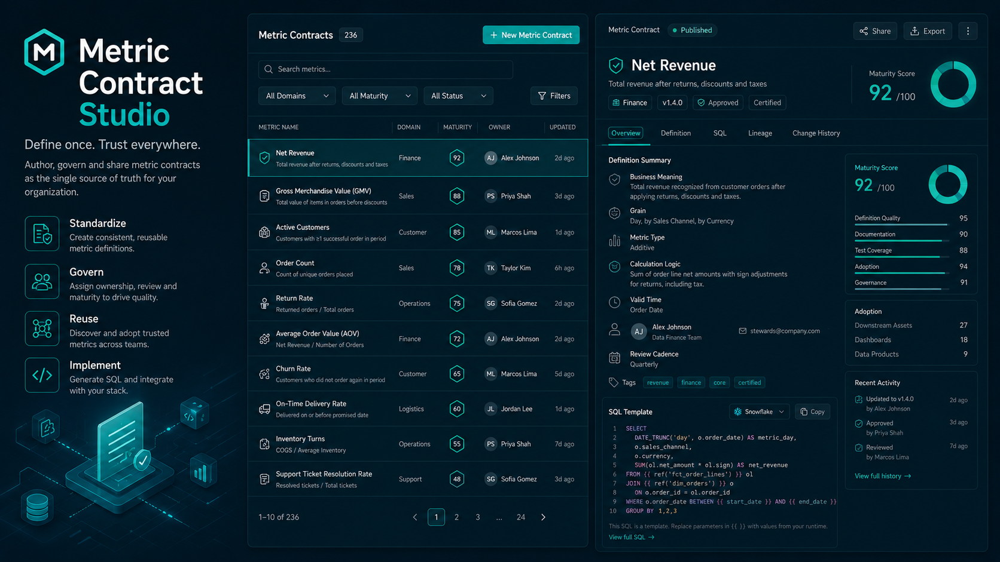
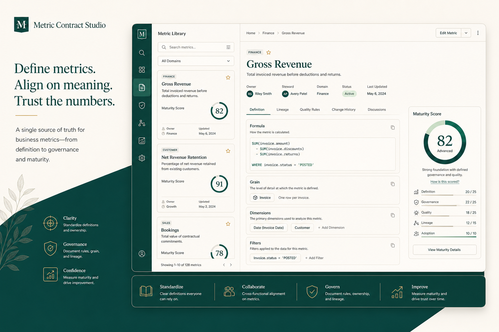
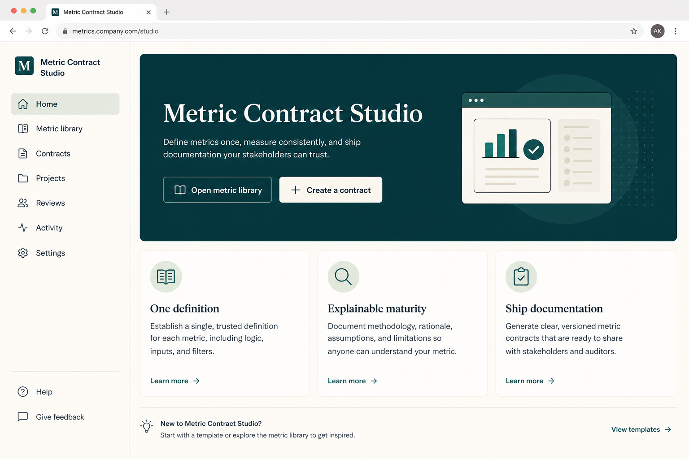
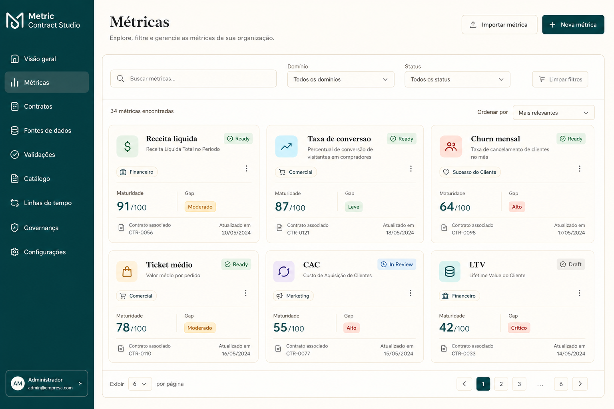
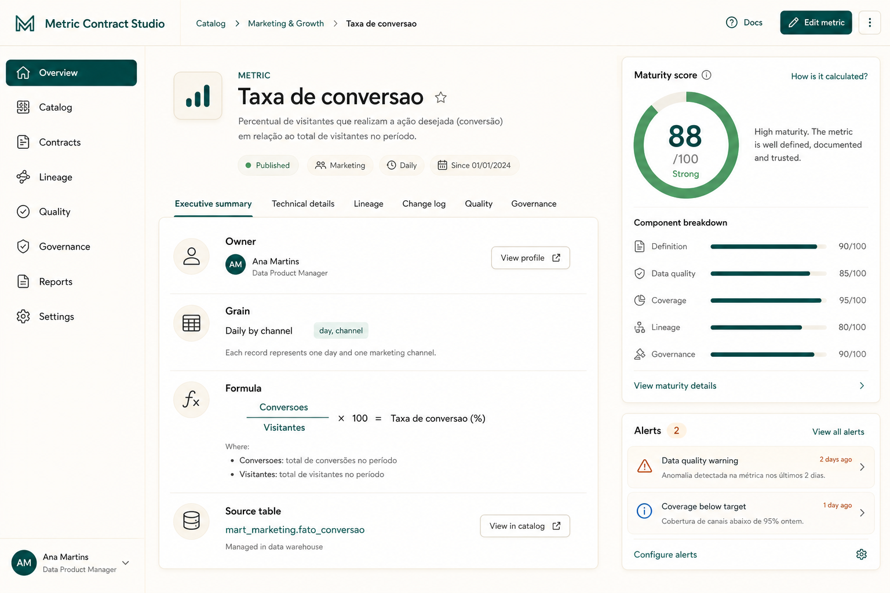
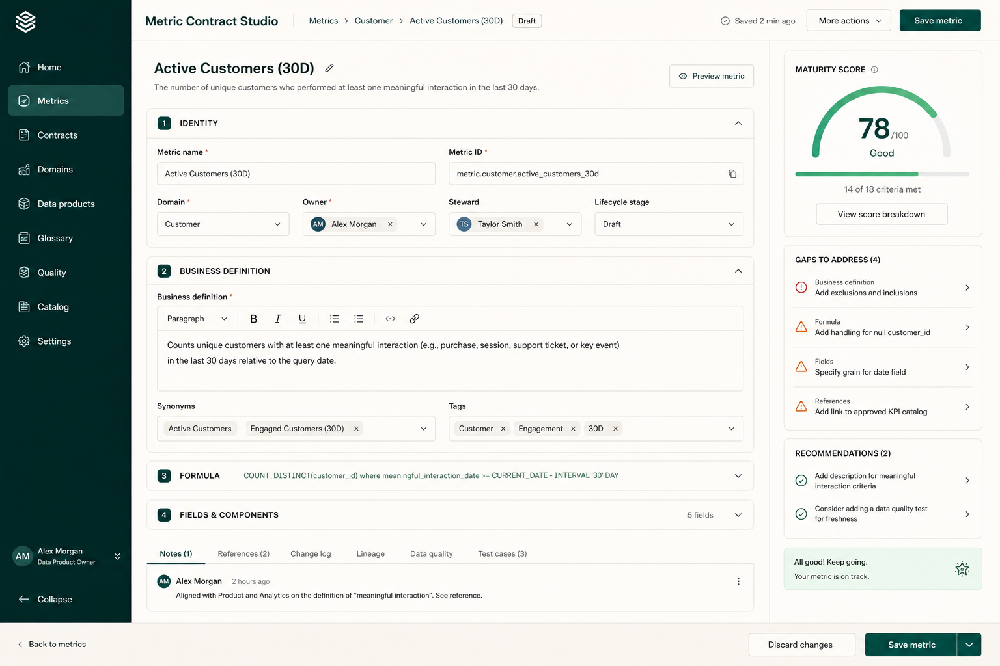
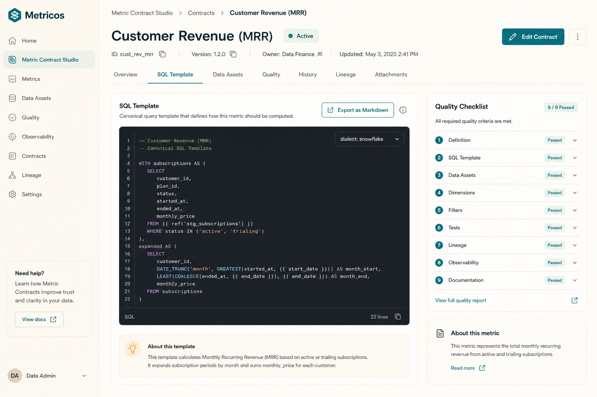
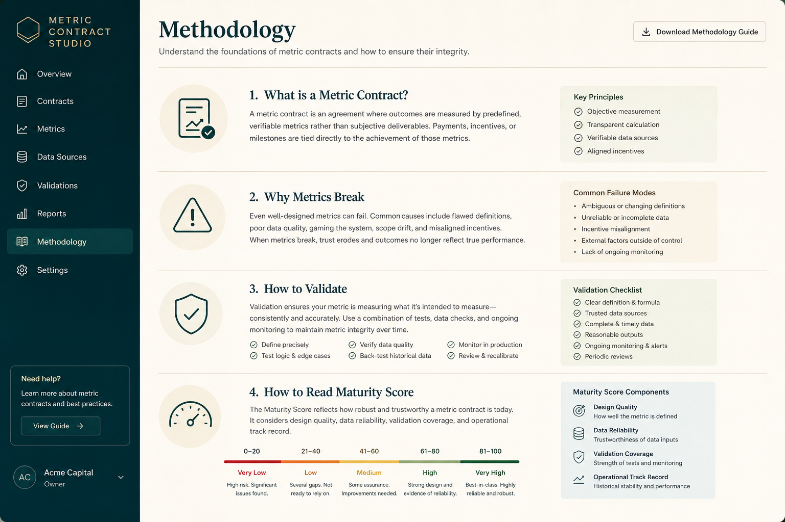
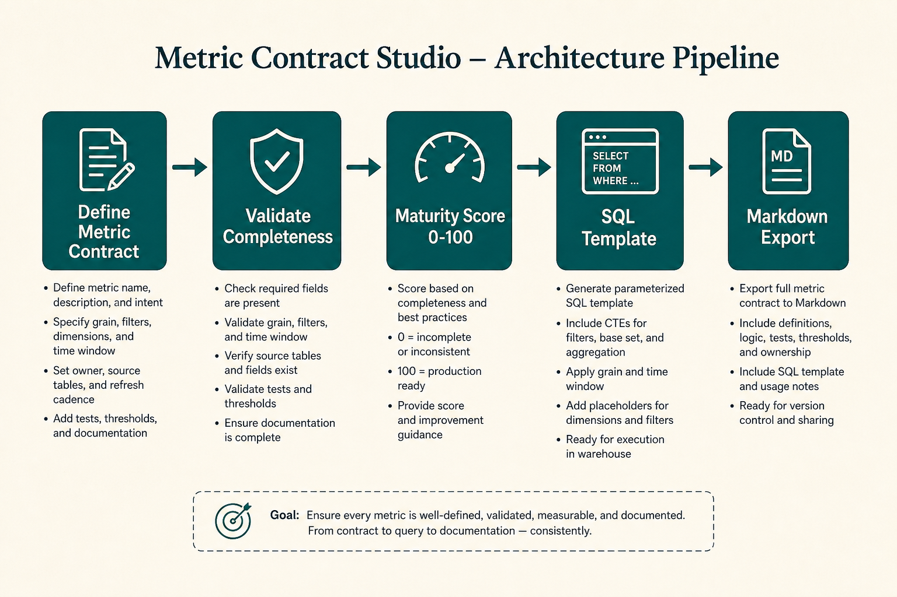

<div align="center">
  

  <h1>Metric Contract Studio</h1>

  <p><strong>Criação, validação, score de maturidade e exportação de contratos de métricas de negócio.</strong></p>
  <p><strong>Create, validate, score and export business metric contracts for analytics governance.</strong></p>

  <p>
    <a href="#1-visão-geral--overview">PT-BR / English Overview</a> •
    <a href="#-product-preview">Preview</a> •
    <a href="#-screenshots">Screenshots</a> •
    <a href="#-stack--tecnologias">Stack</a> •
    <a href="#-arquitetura--architecture">Architecture</a> •
    <a href="#-quick-start--início-rápido">Quick Start</a> •
    <a href="#-autor--author">Author</a>
  </p>

  <p>
    
    
    
    
    
    
  </p>
</div>

<p align="center">
  
</p>

---

## 1. Visão Geral / Overview

O **Metric Contract Studio** é um produto de analytics engineering criado para transformar KPIs ambíguos em **contratos de métrica** revisáveis.

Ele permite definir objetivo de negócio, fórmula, fonte, granularidade, owner, regras de validação, limitações e exemplos de uso — e então calcula um **score de maturidade explicável (0–100)**, gera **SQL template**, checklist de qualidade e **exportação Markdown**. Em vez de tratar métricas como tiles de dashboard, o Studio as trata como artefatos de governança.

O projeto foi desenvolvido por **Felipe Alirio Baruja** como peça de portfólio para analytics engineering, combinando modelagem conceitual, qualidade de dados, documentação técnica e UX de ferramenta interna.

> **Governance Notice**  
> O Metric Contract Studio documenta e valida definições de métricas. Ele **não executa SQL** contra warehouses externos e **não substitui** semantic layers (dbt/MetricFlow) no MVP. O SQL gerado é template documentado, não job de produção.

---

## ✨ Product Preview

<p align="center">
  
</p>

O Metric Contract Studio apresenta uma experiência de ferramenta interna focada em governança: biblioteca de contratos, score de maturidade, alertas de lacunas, SQL template e exportação Markdown.

---

## 2. Por que este projeto importa? / Why this project matters

* **Métricas sem contrato geram conflito:** Receita, conversão, churn e ativação mudam de significado entre times. Sem definição única, dashboards discordam e decisões pioram.
* **Governança precisa ser produto:** Documentação em wiki solta não escala. Um contrato com validação, score e exportação torna a definição revisável.
* **Analytics engineering é mais que SQL:** O projeto prova julgamento de modelagem, qualidade, ownership e comunicação com stakeholders.
* **Portfólio com sinal real:** Em vez de só mostrar gráficos, demonstra como um time de dados evita caos semântico antes da visualização.

---

## 🧠 O diferencial do Metric Contract Studio / What makes it different

### Português
O Metric Contract Studio não é um formulário genérico. Ele combina governança de métricas, validação de completude e documentação operacional em uma experiência rastreável.

Ele mostra não apenas a definição da métrica, mas também:
- quão maduro o contrato está;
- quais lacunas críticas bloqueiam o status `ready`;
- quais warnings ainda merecem atenção;
- como gerar um SQL template a partir do contrato;
- como exportar um artefato Markdown para wiki/PR;
- como exemplos corretos e incorretos reduzem uso indevido.

### English
Metric Contract Studio is not a generic form. It combines metric governance, completeness validation and operational documentation into one traceable experience.

It shows not only the metric definition, but also:
- how mature the contract is;
- which critical gaps block `ready` status;
- which warnings still deserve attention;
- how to generate a SQL template from the contract;
- how to export a Markdown artifact for wiki/PR;
- how correct/incorrect examples reduce misuse.

---

## 🎯 Problema que resolve / The problem it solves

Em fluxos reais de analytics, métricas costumam quebrar por:
- granularidade ambígua (pedido vs sessão vs usuário);
- filtros ocultos (bots, testes, estornos, contas internas);
- owners genéricos (“time de dados”);
- rates/ratios sem numerador e denominador explícitos;
- ausência de regras de validação;
- falta de limitações e exemplos de uso incorreto;
- SQL copiado de Slack sem fonte de verdade;
- dashboards conflitantes com a mesma label de KPI.

O **Metric Contract Studio** cria uma camada auditável entre a intenção de negócio e a implementação analítica.

---

## 🧩 Proposta / Metric Contract Pipeline

O Studio transforma uma métrica em um contrato governável:

```txt
Business Question
  ↓
Metric Contract (identity, formula, source, grain, owner)
  ↓
Validation Rules + Fields + Usage Examples
  ↓
Completeness Alerts (critical / warning)
  ↓
Explainable Maturity Score (0–100)
  ↓
SQL Template + Quality Checklist
  ↓
Markdown Export (wiki / PR / handoff)
```

---

## 📸 Screenshots

<table>
  <tr>
    <td width="50%">
      
      <br />
      <sub><strong>Metrics Library</strong> — contratos com status, domínio, score e badges de lacunas.</sub>
    </td>
    <td width="50%">
      
      <br />
      <sub><strong>Metric Detail</strong> — resumo executivo, score explicável e alertas de governança.</sub>
    </td>
  </tr>
  <tr>
    <td width="50%">
      
      <br />
      <sub><strong>Metric Editor</strong> — formulário seccionado com maturidade e gaps em tempo real.</sub>
    </td>
    <td width="50%">
      
      <br />
      <sub><strong>SQL & Export</strong> — template SQL documentado, checklist e exportação Markdown.</sub>
    </td>
  </tr>
  <tr>
    <td width="50%">
      
      <br />
      <sub><strong>Methodology</strong> — o que é contrato de métrica, por que quebra e como validar.</sub>
    </td>
    <td width="50%">
      
      <br />
      <sub><strong>Home</strong> — tese do produto, CTAs e posicionamento de governança.</sub>
    </td>
  </tr>
</table>

---

## 📄 Artefatos de Handoff

O Studio gera artefatos prontos para operação e entrevista:

- **Markdown contract** com identidade, fórmula, fonte, validações, score e checklist
- **SQL template** por tipo de métrica (`sum`, `rate`, `average`, etc.)
- **Quality checklist** para revisão antes de adoção ampla
- **HANDOFF_PORTFOLIO.md** com copy para LinkedIn e entrevistas

---

## 📌 Estudo de Caso / Case Study

### 📌 Estudo de Caso: Métricas SaaS / E-commerce
O MVP inclui 5 contratos demo prontos: **Receita líquida**, **Taxa de conversão**, **Churn mensal**, **Ticket médio** e **Ativação de usuário**. Cada um traz pergunta de negócio, fórmula, fonte, grain, validações, limitações e exemplos corretos/incorretos.

A camada de validação bloqueia status `ready` quando faltam owner, fórmula, fonte, grain, refresh ou regras — e exige numerador/denominador em métricas `rate`/`ratio`. O score de maturidade explica pontos ganhos e perdidos por componente.

### 📌 Case Study: SaaS / E-commerce Metrics
The MVP ships 5 ready demo contracts: **Net revenue**, **Conversion rate**, **Monthly churn**, **Average order value** and **User activation**. Each includes business question, formula, source, grain, validations, limitations and correct/incorrect usage examples.

Validation blocks `ready` status when owner, formula, source, grain, refresh or rules are missing — and requires numerator/denominator for `rate`/`ratio` metrics. The maturity score explains earned and lost points by component.

---

## 🧭 Visual Story / Jornada do Usuário

A experiência foi pensada como uma jornada de governança:

```txt
1. Abrir a Home e entender a tese do produto
2. Entrar na Library e carregar métricas demo
3. Abrir um contrato (ex.: Taxa de conversão)
4. Ler score de maturidade e alertas de lacunas
5. Revisar SQL template e checklist de qualidade
6. Exportar Markdown do contrato
7. Criar/editar uma métrica e ver validação ao vivo
8. Consultar Methodology para o framework de contrato
```

---

## ⚙️ Funcionalidades Principais / Core Features

### Metric Library
Biblioteca filtrável por domínio e status, com cards de maturidade e badges de gaps críticos.

### Contract Editor
Formulário em seções: identidade, negócio, fórmula/campos, fonte/grain, validações, limitações/exemplos — com score e alertas live.

### Maturity Score
Score 0–100 explicável:
- Business definition (20)
- Formula & fields (20)
- Source & granularity (20)
- Validations (20)
- Limitations & examples (10)
- Owner & maintenance (10)

### Validation Gates
Regras críticas e warnings testáveis (Vitest), incluindo bloqueio de `ready` para contratos incompletos.

### SQL Template + Markdown Export
Geração de template SQL documentado e exportação do contrato completo em Markdown.

### Demo Metrics Loader
Carga de 5 métricas SaaS/e-commerce para demonstração imediata.

---

## 🛠️ Stack / Tecnologias

### Frontend
- **Framework:** Next.js 16 (App Router) & React 19
- **Linguagem:** TypeScript
- **Estilização:** Tailwind CSS v4
- **Estado:** Zustand + localStorage
- **Validação de modelo:** Zod schemas + regras puras
- **Indicadores:** Recharts
- **Testes:** Vitest

### Escopo do MVP
- Frontend-first (sem backend pesado)
- Persistência local via `localStorage`
- Sem auth, multi-usuário ou execução real de SQL

---

## 🧱 Arquitetura / Architecture

```text
metric-contract-studio/
├── src/
│   ├── app/                         # Rotas App Router
│   │   ├── page.tsx                 # Home
│   │   ├── metrics/                 # Library / New / Detail / Edit
│   │   ├── examples/                # Catálogo demo
│   │   └── methodology/             # Metodologia de contrato
│   │
│   ├── components/
│   │   ├── layout/                  # AppShell
│   │   ├── metrics/                 # Cards, score, gaps, sections
│   │   ├── forms/                   # MetricForm + ValidationRulesEditor
│   │   ├── export/                  # SQL viewer + Markdown export
│   │   └── ui/                      # Badges, EmptyState
│   │
│   ├── lib/                         # Domínio puro e testável
│   │   ├── metric-model.ts
│   │   ├── validation.ts
│   │   ├── maturity-score.ts
│   │   ├── sql-generator.ts
│   │   ├── markdown-export.ts
│   │   ├── demo-data.ts
│   │   ├── storage.ts
│   │   ├── store.ts
│   │   └── schemas.ts
│   │
│   └── tests/                       # Vitest (validação, score, export, demo)
│
├── docs/                            # Metodologia, examples, data model, case
├── assets/                          # Icon, hero, screenshots, social preview
├── HANDOFF_PORTFOLIO.md             # Copy de portfólio / entrevista
└── README.md                        # Esta documentação
```

---

## 🧱 Visual Architecture

<p align="center">
  
</p>

Metric Contract Studio follows a governance flow: define the contract, validate completeness, score maturity, generate SQL template and export Markdown documentation.

---

## 🔁 Data Flow Pipeline

```txt
User Input / Demo Metrics
  ↓
MetricContract domain model
  ↓
Pure validation rules (critical + warning)
  ↓
Explainable maturity scoring
  ↓
SQL template generation
  ↓
Markdown export + quality checklist
  ↓
localStorage persistence (MVP)
```

---

## 🚀 Quick Start / Início Rápido

### Pré-requisitos
- **Node.js** v20 ou superior
- **npm**
- **Git**

### Execução local

```bash
git clone https://github.com/BarujaFe1/metric-contract-studio.git
cd metric-contract-studio
npm install
npm run dev
```

Abra [http://localhost:3000](http://localhost:3000).

As métricas demo são carregadas automaticamente na primeira visita (localStorage).

---

## 🧪 Scripts e Testes / Scripts and Testing

```bash
npm test          # Vitest — validação, score, SQL, Markdown, demo data
npm run lint      # ESLint
npm run build     # Build de produção Next.js
npm run dev       # Servidor de desenvolvimento
```

### Cobertura de testes do MVP
1. slug generation  
2. validação sem owner  
3. validação sem grain  
4. rate sem numerador/denominador  
5. cálculo de maturity score  
6. geração de Markdown  
7. geração de SQL template  
8. consistência das métricas demo  

---

## 📊 Metodologia de Contrato / Contract Methodology

Um **contrato de métrica** é a fonte de verdade revisável de um KPI.

### Gates críticos (não pode ser `ready`)
- owner
- business question
- formula
- source system + table
- grain
- refresh frequency
- pelo menos 1 validation rule
- numerator/denominator para `rate`/`ratio`

### Warnings
- limitations vazias
- sem exemplo de uso incorreto
- sem default filters
- sem required fields
- owner genérico (“data team”)
- fórmula muito curta

Documentação completa: [`docs/metric-contract-methodology.md`](./docs/metric-contract-methodology.md)

---

## 🛡️ Limitações Honestas / Honest Limitations

* Persistência apenas em `localStorage` (MVP)
* SQL é template documentado, não execução em warehouse
* Sem autenticação / multi-usuário / permissões
* Sem integração dbt / MetricFlow no MVP
* Screenshots em `assets/` são previews de produto para portfólio

---

## 🧭 Roadmap do Produto

* **Fase 0 — MVP local:** contratos, score, SQL, Markdown, demos, testes
* **Fase 1 — Persistência:** API + SQLite/Postgres
* **Fase 2 — Review workflow:** draft → review → ready com versionamento
* **Fase 3 — Semantic layer:** export para dbt docs / MetricFlow
* **Fase 4 — Quality runners:** checks SQL conectados a sandbox
* **Fase 5 — E2E:** Playwright no fluxo criar → validar → exportar

---

## 💼 Valor para Portfólio / Portfolio Value

O Metric Contract Studio demonstra competências críticas para **Analytics Engineering** e **Data Product**:

- governança de métricas e definição semântica
- modelagem conceitual de contratos de KPI
- design de validação e qualidade de dados
- documentação técnica como produto
- UX de ferramenta interna
- TypeScript forte com regras puras e testáveis
- pensamento de produto para times de dados

---

## 📚 Documentação Complementar

- [`HANDOFF_PORTFOLIO.md`](./HANDOFF_PORTFOLIO.md) — títulos, bullets, roteiro de entrevista e post de LinkedIn
- [`docs/metric-contract-methodology.md`](./docs/metric-contract-methodology.md) — metodologia de contrato
- [`docs/examples.md`](./docs/examples.md) — métricas demo documentadas
- [`docs/data-model.md`](./docs/data-model.md) — modelo conceitual
- [`docs/portfolio-case.md`](./docs/portfolio-case.md) — framing de case para entrevista

---

## 🖼️ GitHub Social Preview

Uma imagem para visualização social está disponível em:

```txt
assets/social-preview.png
```

*Dimensão recomendada: 1280×640, &lt;1MB. Faça upload em: Repository Settings → Social Preview.*

---

## 🔖 GitHub Repository Metadata

### About sugerido
```txt
Create, validate, score and export business metric contracts for analytics engineering governance.
```

### Topics sugeridos
```txt
analytics-engineering
metric-governance
data-quality
nextjs
typescript
tailwindcss
zustand
vitest
portfolio-project
data-documentation
sql-templates
business-metrics
kpi
semantic-layer
```

---

## 👤 Autor / Author

Desenvolvido por **Felipe Alirio Baruja**.

- **Portfolio:** [barujafe.vercel.app](https://barujafe.vercel.app/)
- **GitHub:** [@BarujaFe1](https://github.com/BarujaFe1)
- **LinkedIn:** [Gustavo Felipe Alirio Baruja](https://www.linkedin.com/in/barujafe/)

---

## 📄 Licença / License

MIT License. Copyright (c) 2026 Felipe Alirio Baruja.

O código está disponível sob a licença MIT — ver arquivo [`LICENSE`](./LICENSE).
